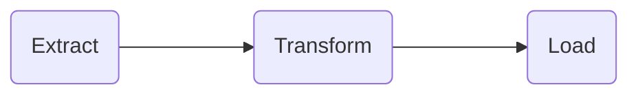

# pura
Pura helps you clean chemical and reaction data. It fills the gap of making chemical data useable for machine learning algorithms. You can use pura to:

- Resolve common chemical names (e.g., aspirin) to standard cheminformatics identifiers like SMILES
- Balance and atom-map reactions (future)
- Extract reaction templates (future)

## Installation

```bash
pip install pura
```

## What you can do with Pura

Pura can help with both compounds and reactions. Below are examples of its key features.

### Resolve common names to SMILES

Compounds are often recorded as common names instead of a machine readable identifier like SMILES.

There are several services that can do name resolution (PubChem, Chemical Identity Resolver, ChemSpider), and they sometimes disagree. Pura enables you to check several services asynchronously and ensure that a certain number agree on the resolved identifier. You can then discard or manually check the names that could not be resolved.

You can find a full list of services [here](https://github.com/sustainable-processes/pura/tree/main/pura/services).

```python
# Import pura
from pura.resolvers import resolve_names
from pura.compound import CompoundIdentifierType
from pura.services import Pubchem, CIR, Opsin

# Resolve names to SMILES
resolved = resolve_identifiers(
    ["Josiphos SL-J001-1", "Rh(NBD)2BF4", "DuPhos"],
    input_identifer_type=CompoundIdentifierType.NAME,
    output_identifier_type=CompoundIdentifierType.SMILES,
    backup_identifier_types=[
        CompoundIdentifierType.INCHI_KEY,
        CompoundIdentifierType.CAS_NUMBER,
    ],
    services=[PubChem(autocomplete=True), CIR(), CAS(), ChemSpider()],
    agreement=1,
    silent=True,
)
print("\nResults\n")
for input_compound, resolved_identifiers in resolved:
    print(input_compound.identifiers[0].value, resolved_identifiers)
    print()
#Josiphos SL-J001-1 [CompoundIdentifier(identifier_type=<CompoundIdentifierType.SMILES: 2>, #value='C1CCCC1.CC(C1CCCC1P(c1ccccc1)c1ccccc1)P(C1CCCCC1)C1CCCCC1.[Fe]', details=None)]

# Rh(NBD)2BF4 [CompoundIdentifier(identifier_type=<CompoundIdentifierType.SMILES: 2>, value='C1=CC2C=CC1C2.C1=CC2C=CC1C2.F[B-](F)(F)F.[Rh]', details=None)]

# Dichloro(p-cymene)ruthenium(II) dimer [CompoundIdentifier(identifier_type=<CompoundIdentifierType.SMILES: 2>, value='Cc1ccc(C(C)C)cc1.Cc1ccc(C(C)C)cc1.Cl[Ru]Cl.Cl[Ru]Cl', details=None)]

# DuPhos [CompoundIdentifier(identifier_type=<CompoundIdentifierType.SMILES: 2>, value='CC(C)C1CCC(C(C)C)P1c1ccccc1P1C(C(C)C)CCC1C(C)C', details=None)]
```
## Concepts behind Pura

Pura is a package for the transform part of extract-transform-load (ETL) workflows in cheminformatics.



## Development

### Roadmap

- [x] Name resolution (July 2022)
- [x] Reaction representations (July 2022)
- [ ] Reaction balancing (July - August 2022)
- [ ] Reaction mapping (reaction mapper initially) (July - August 2022)
- [ ] Reports on quality (August 2022)
- [ ] Comparison quality of balancing and mapping on reaxys, USPTO and pistachio (September 2022)
- [ ] Write and submit paper to Neurips science workshop (September - October 2022)
- [ ] Publish package on pypi (September 2022)
- [ ] Documentation and website (November 2022)
- [ ] Template extraction (December 2022)
- [ ] Agreement/consensus algorithms for multiple representations of compounds

### Getting set up

1. Install poetry using the following or via the instructions [here](https://python-poetry.org/docs/#installation):

    ```bash
    curl -sSL https://raw.githubusercontent.com/python-poetry/poetry/master/get-poetry.py | python -
    ```

2. Clone the repository:

    ```bash
    git clone https://github.com/sustainable-processes/pura.git
    cd pura
    ```

3. Install the dependencies from `poetry.lock`:

    ```bash
    poetry install
    ```

Once you make some changes, commit and push:

```bash
git commit -am <YOUR COMMIT MESSAGE>
git push
```


## Resources

- [Reaction Data Curation I: Chemical Structures and Transformations Standardization](https://doi.org/10.1002/minf.202100119)
- [RDchiral](https://github.com/connorcoley/rdchiral)
- [Selfies](https://github.com/aspuru-guzik-group/selfies)
- [CGRTools](https://doi.org/10.1021/acs.jcim.9b00102)
- [ChemDataExtractor](https://github.com/mcs07/ChemDataExtractor)
